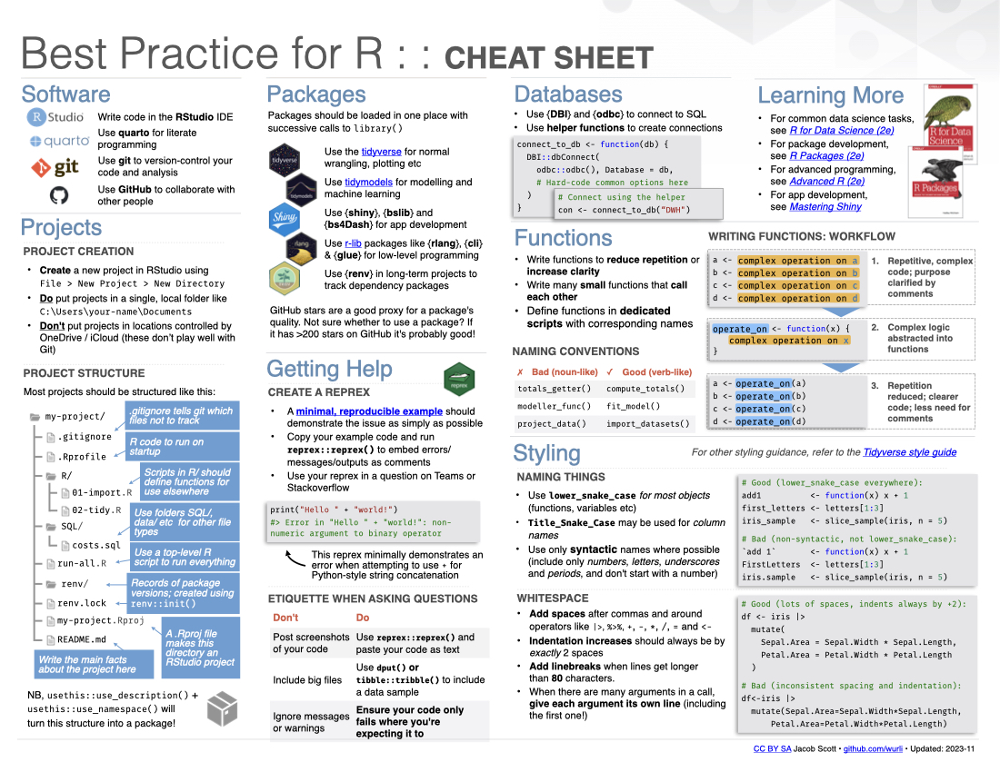

# Best Practice for R :: Cheat Sheet

The information here is obviously highly opinionated, and by no means gives
the only correct way to do things. This is simply intended to be a quick primer
for developers new to R who have an interest in doing things well.

I originally created a 
[similar version](https://dfe-r-community.github.io/posts/2023-03-14-best-practice-essentials/) 
of this cheatsheet specifically for use in the UK Department for Education. This
is a slightly more generalised version.

Feel free to adapt and use this cheatsheet for your own use, but please give 
credit! If you're using GitHub, the best way to do this is by creating a 
fork of this repo. Please also push your changes so others can benefit!

This cheatsheet is inspired by (and has now been added to) the
[cheatsheets](https://github.com/rstudio/cheatsheets) created by Posit for other
data science software. 
